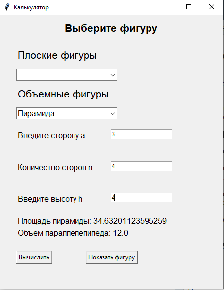

Геометрический калькулятор
==========================
Задача
------------------
При помощи ООП спроектировать и реализовать геометрический калькулятор для вычислений, производимых над фигурами.
Калькулятор должен поддерживать вычисления для плоских и объемных фигур.

**Плоские фигуры:** круг, квадрат, прямоугольник, треугольник, трапеция, ромб.

**Объемные фигуры**: сфера, куб, параллелепипед, пирамида, цилиндр, конус.

Реализовать как минимум один общий метод вычисления для всех фигур и как минимум один специфичный для определенных фигур.
Например, площадь – общий метод для всех фигур, медиана – специфичный метод для ряда фигур.

Реализовать интерфейс программы для возможности взаимодействия пользователя с ней.
Интерфейс может быть консольным или графическим.

**Задание со звездочкой**: Реализовать визуализацию фигур на плоскости и в пространстве.

Решение задачи 
------------------
О программе 
~~~~~~~~~~~~~~~~~~

Программа является оконным приложением. Сверху расположены два выпадающих списка. В-первом хранятся плоские фигуры, во-втором, соответственно, объемные. При выборе фигуры пользователю предоставляется возможность ввести необходимые данные. Например, для пирамиды это будет: сторона основания, количество сторон у основания и высота, опущенная из верхней вершины. Затем пользователь может нажать кнопку "Вычислить". После этого появятся некоторые расчеты. У всех фигур рассчитывается площадь, у объёмных также рассчитывается объем. У некоторых фигур рассчитываются: диагонали, средние линии. После расчета пользователь может нажать на кнопку "Показать фигуру" - откроется окна с графиком данной фигуры, учитывая данные, которые ввел пользователь.

Описание кода 
~~~~~~~~~~~~~~~~~~
Библиотеки
""""""""""""""""""

::

    from math import pi
    from math import tan
    import tkinter as tk
    from tkinter.ttk import Combobox
    from typing import Tuple, NoReturn, Any, List
    import matplotlib.pyplot as plt
    import numpy as np

Для реализации графического интерфейса была задействована библиотека  tkinter. Для отрисовки графики была задействована библиотека matplotlib.

Описание классов и их методов
"""""""""""""""""""""""""""""

Существует глобальный класс Shape. У данного класса есть неопределенный метод вычисления площади. У класса Shape существует дочерний класс Polygon. Данные классы нужны для поддержании иерархии.

::

    class Shape:
        title: str = 'Фигура'
    
        def area(self) -> float:
            pass
    
    
    class Polygon(Shape):
        title: str = 'Многоугольник'
    
        def area(self) -> float:
            pass

У класса Polygon есть 6 дочерних классов: Square, Rectangle, Rhombus, Trapezoid, Triangle, Circle.

Класс Square имеет конструктор и 2 метода: area - нахождение площади, diagonal - статичный метод для нахождения диагонали. В конструктор передается параметр 'a' (сторона квадрата). Нахождение площади осуществляется по формуле:

.. math:: 

    \S=a^2

Нахождение диагонали осуществляется по формуле:

.. math::S = a*2^(1/2)

::
         
    class Square(Polygon):
        title: str = 'Квадрат'
    
        def __init__(self, a: float) -> None:
            self.a = a
    
        def area(self) -> float:
            return self.a ** 2
    
        @staticmethod
        def diagonal(a: float) -> float:
            return a * (2 ** (1 / 2))

Класс Rectangle имеет конструктор и 2 метода: area - нахождение площади, diagonal - статичный метод для нахождения диагонали. В конструктор передаются параметры 'a', 'b' (стороны прямоугольника). Нахождение площади осуществляется по формуле:

.. math::
S = a*b

Нахождение диагонали осуществляется по формуле:

.. math::
S = (a^2 + b^2)^(1/2) 

::
    
    
    class Rectangle(Polygon):
        title: str = 'Прямоугольник'
    
        def __init__(self, a: float, b: float) -> None:
            self.a = a
            self.b = b
    
        def area(self) -> float:
            return self.a * self.b
    
        @staticmethod
        def diagonal(a: float, b: float) -> float:
            return (a ** 2 + b ** 2) ** (1 / 2)

Класс Rhombus имеет конструктор и 1 метод: area - нахождение площади. В конструктор передаются параметры 'a', 'h' (сторона ромба и высота опущенная на эту сторону). Нахождение площади осуществляется по формуле:

.. math::
S = a*h

::    
    
    class Rhombus(Polygon):
        title: str = 'Ромб'
    
        def __init__(self, a: float, h: float) -> None:
            self.a = a
            self.h = h
    
        def area(self) -> float:
            return self.a * self.h

Класс Trapezoid имеет конструктор и 2 метода: area - нахождение площади, middle_line- статичный метод для нахождения средней линии. В конструктор передаются параметры 'a', 'b', 'h' (основания трапеции - 'a', 'b', высота трапеции - 'h'). Нахождение площади осуществляется по формуле:

.. math::
S = ((a + b) / 2) * h

Нахождение средней линии осуществляется по формуле:

.. math::
S = (a + b) / 2

::    
    
    class Trapezoid(Polygon):
        title: str = 'Трапеция'
    
        def __init__(self, a: float, b: float, h: float) -> None:
            self.a = a
            self.b = b
            self.h = h
    
        def area(self) -> float:
            return ((self.a + self.b) / 2) * self.h
    
        @staticmethod
        def middle_line(a: float, b: float) -> float:
            return (a + b) / 2

Класс Triangle имеет конструктор и 2 метода: area - нахождение площади, middle_line- статичный метод для нахождения средних линий. В конструктор передаются параметры 'a', 'b', 'c' (стороны треугольника). Нахождение площади осуществляется по формуле Герона:

.. math::
p = (a + b + c) / 2
S = (p * (p - a) * (p - b) * (p - c))^(1/2)

Нахождение средних линий осуществляется по формуле:

.. math::
M_a = a / 2
M_b = a / 2
M_c = a / 2

::  
    
    
    class Triangle(Polygon):
        title: str = 'Треугольник'
    
        def __init__(self, a: float, b: float, c: float) -> None:
            self.a = a
            self.b = b
            self.c = c
    
        def area(self) -> float:
            p: float = (self.a + self.b + self.c) / 2
            return (p * (p - self.a) * (p - self.b) * (p - self.c)) ** (1/2)
    
        @staticmethod
        def middle_line(a: float, b: float, c: float) -> Tuple[float, float, float]:
            middle_line_a: float = a / 2
            middle_line_b: float = b / 2
            middle_line_c: float = c / 2
            return middle_line_a, middle_line_b, middle_line_c

Класс Circle имеет конструктор и 2 метода: area - нахождение площади, circumference- статичный метод для длины окружности. В конструктор передается параметр 'r' (радиус окружности). Нахождение площади осуществляется по формуле:

.. math::
S = pi*r^2

Нахождение длины окружности осуществляется по формуле:

.. math::
d = 2*pi*r

:: 
    
    
    class Circle(Shape):
        title: str = 'Окружность'
    
        def __init__(self, r: float) -> None:
            self.r = r
    
        def area(self) -> float:
            return pi * (self.r ** 2)
    
        @staticmethod
        def circumference(r: float) -> float:
            return 2 * pi * r

Класс Cube является дочерним для класса Square. Он имеет 2 метода: area - нахождение площади, volume - нахождение объема. В конструктор передается параметр 'a' (сторона куба). Нахождение площади осуществляется по формуле:

.. math::
S = 6 * (a^2)

Нахождение объема осуществляется по формуле:

.. math::
V = a^3

::    
    
    class Cube(Square):
        title: str = 'Куб'
    
        def area(self) -> float:
            return 6 * (self.a ** 2)
    
        def volume(self) -> float:
            return self.a ** 3

Класс Parallelepiped является дочерним для класса Rectangle. Он имеет конструктор и 3 метода: area - нахождение площади, volume - нахождение объема, p_diagonal - нахождение диагонали. В конструктор передаются параметры 'a', 'b', 'c' (стороны параллелепипеда). Нахождение площади осуществляется по формуле:

.. math::
S = 2 * (a * b + b * c + a * c)

Нахождение объема осуществляется по формуле:

.. math::
V = a * b * c

Нахождение диагонали осуществляется по формуле:

.. math::
V = (a^2 + b^2 + c^2)^(1/2)

::
    
    
    class Parallelepiped(Rectangle):
        title: str = 'Параллелепипед'
    
        def __init__(self, a: float, b: float, c: float) -> None:
            super().__init__(a, b)
            self.c = c
    
        def area(self) -> float:
            return 2 * (self.a * self.b + self.b * self.c + self.a * self.c)
    
        def volume(self) -> float:
            return self.a * self.b * self.c
    
        @staticmethod
        def p_diagonal(a: float, b: float, c: float) -> float:
            return (a**2 + b**2 + c**2) ** (1/2)

Класс Pyramidявляется дочерним для класса Shape. Он имеет 2 метода: area - нахождение площади, volume - нахождение объема. В конструктор передается параметр 'a', 'n', 'h' (сторона основания правильного многоугольника - 'a', количество сторон многоугольника - 'n', высота, проведенная из верхней вершины к основанию - 'h' ). Нахождение площади осуществляется по формуле:

.. math::
L = (h ^ 2 + (a / (2 * tan(pi / n))) ^ 2) ^ (1/2)

S_бп = ((n * a) / 2) * L

S_по = (n * a ^ 2) / (4 * tan(pi / n))

S = S_бп + S_по

Нахождение объема осуществляется по формуле:

.. math::
V = (1/3) * S_по * h

:: 
    
    
    class Pyramid(Shape):
        title: str = 'Пирамида'
    
        def __init__(self, a: float, n: float, h: float) -> None:
            self.a = a
            self.n = n
            self.h = h                                                              # высота, опущенная к основанию
    
        def area(self) -> float:
            L: float = (self.h ** 2 + (self.a / (2 * tan(pi / self.n))) ** 2) ** (1/2)     # апофема
            s_bp: float = ((self.n * self.a) / 2) * L                                      # площадь боковой поверхности
            s_po: float = (self.n * self.a ** 2) / (4 * tan(pi / self.n))                  # площадь поверхности основания
            return s_bp + s_po
    
        def volume(self) -> float:
            s_po: float = (self.n * self.a ** 2) / (4 * tan(pi / self.n))
            return round(((s_po * self.h) / 3), 4)

Класс Sphere является дочерним для класса Circle. Он имеет и 2 метода: area - нахождение площади, volume - нахождение объема. В конструктор передаются параметры 'r' (радиус сферы). Нахождение площади осуществляется по формуле:

.. math::
S = 4 * pi * r ^ 2

Нахождение объема осуществляется по формуле:

.. math::
V = (4 * pi * self ^ 3) / 3

::
    
    
    class Sphere(Circle):
        title: str = 'Сфера'
    
        def area(self) -> float:
            return 4 * pi * self.r ** 2
    
        def volume(self) -> float:
            return (4 * pi * self.r ** 3) / 3

Класс Cone является дочерним для класса Circle. Он имеет конструктор и 2 метода: area - нахождение площади, volume - нахождение объема. В конструктор передаются параметры 'r', 'h' (радиус окружности основания - 'r', высота - 'h'). Нахождение площади осуществляется по формуле:

.. math::
L = (r ^ 2 + h ^ 2) ** (1/2)

S = pi * r * (r + L)

Нахождение объема осуществляется по формуле:

.. math::
V = (pi * (r ^ 2) * h) / 3

::
    
    
    class Cone(Circle):
        title: str = 'Конус'
    
        def __init__(self, r: float, h: float) -> None:
            super().__init__(r)
            self.h = h
    
        def area(self) -> float:
            L: float = (self.r ** 2 + self.h ** 2) ** (1/2)
            return pi * self.r * (self.r + L)
    
        def volume(self) -> float:
            return (pi * (self.r ** 2) * self.h) / 3

Класс Cylinder является дочерним для класса Circle. Он имеет конструктор и 2 метода: area - нахождение площади, volume - нахождение объема. В конструктор передаются параметры 'r', 'h' (радиус окружности основания - 'r', высота - 'h'). Нахождение площади осуществляется по формуле:

.. math::
S = 2 * pi * r * (h + r)

Нахождение объема осуществляется по формуле:

.. math::
V = pi * r ^ 2 * h

::
    
    
    class Cylinder(Circle):
        title: str = 'Цилиндр'
    
        def __init__(self, r: float, h: float) -> None:
            super().__init__(r)
            self.h = h
    
        def area(self) -> float:
            return 2 * pi * self.r * (self.h + self.r)
    
        def volume(self) -> float:
            return pi * self.r ** 2 * self.h

Описание главного кода программы
""""""""""""""""""""""""""""""""
Перед описанием функций для понимая следует описать главный код. Для начала создадим окно размером 450х550. Затем создадим элементы нашего окна. Все элементы располагаем при помощи метода pack(). Для наглядности и понятия как переменные отвечают за какие элементы, приведен рисунок:

Для удобного расположения компоненты first_label и first_entry находятся во фрейме first_frame. Компоненты second_label и second_entry во фрейме second_frame. И компоненты third_label и third_entry  находятся во фрейме third_frame. 

При выборе элемента из первого (плоские фигуры) выпадающего списка запускается обработчик события flat_click. При выборе элемента из второго (объемные фигуры) выпадающего списка запускается обработчик события volume_click. При нажатии на кнопку "Вычислить" запускается функция click(). При нажатии на кнопку "Показать график" запускается функция показа графика plt.show(). 

::

    window = tk.Tk()
    window.title('Калькулятор')
    window.geometry('450x550')
    
    first_frame = tk.Frame(window)
    second_frame = tk.Frame(window)
    third_frame = tk.Frame(window)
    
    h1 = tk.Label(text='Выберите фигуру',
                  font=('Arial', 16, 'bold'),
                  height=2
                  )
    h2 = tk.Label(text='Плоские фигуры',
                  font=('Arial', 16),
                  height=2
                  )
    h3 = tk.Label(text='Объемные фигуры',
                  font=('Arial', 16),
                  height=2
                  )
    
    h1.pack()
    h2.pack(side='top', anchor='nw', padx=34)
    
    combo_flat = Combobox(window, font='Arial')
    combo_flat['values'] = (Circle.title, Square.title, Rectangle.title,
                            Triangle.title, Trapezoid.title, Rhombus.title)
    combo_flat.bind("<<ComboboxSelected>>", flat_click)
    combo_flat.pack(side='top', anchor='nw', padx=34)
    
    h3.pack(side='top', anchor='nw', padx=34)
    
    combo_volume = Combobox(window, font='Arial')
    combo_volume['values'] = (Cube.title, Parallelepiped.title, Pyramid.title,
                              Sphere.title, Cone.title, Cylinder.title)
    combo_volume.bind("<<ComboboxSelected>>", volume_click)
    combo_volume.pack(side='top', anchor='nw', padx=34)
    
    first_label = tk.Label(first_frame,
                           text='',
                           font=('Arial', 12),
                           justify='left'
                           )
    first_entry = tk.Entry(first_frame,
                           width='20')
    
    second_label = tk.Label(second_frame,
                            text='',
                            font=('Arial', 12),
                            justify='left'
                            )
    second_entry = tk.Entry(second_frame,
                            width='20')
    
    third_label = tk.Label(third_frame,
                           text='',
                           font=('Arial', 12),
                           justify='left'
                           )
    third_entry = tk.Entry(third_frame,
                           width='20')
    
    first_calc_label = tk.Label(text='',
                                font=('Arial', 12),
                                justify='left'
                                )
    second_calc_label = tk.Label(text='',
                                 font=('Arial', 12),
                                 justify='left'
                                 )
    third_calc_label = tk.Label(text='',
                                font=('Arial', 12),
                                justify='left'
                                )
    
    first_label.pack(side='left', anchor='nw', padx=34, pady=20)
    second_label.pack(side='left', anchor='nw', padx=34, pady=20)
    third_label.pack(side='left', anchor='nw', padx=34, pady=20)
    
    first_frame.pack(side='top', anchor='nw')
    second_frame.pack(side='top', anchor='nw')
    third_frame.pack(side='top', anchor='nw')
    
    calculate_btn = tk.Button(text='Вычислить', command=lambda: click())
    draw_btn = tk.Button(text='Показать фигуру', command=lambda: plt.show())
    
    first_calc_label.pack(side='top', anchor='nw', padx=34)
    second_calc_label.pack(side='top', anchor='nw', padx=34)
    third_calc_label.pack(side='top', anchor='nw', padx=34)
    
    window.mainloop()

Описание функций
""""""""""""""""""""""""""""""""

Функция flat_click обрабатывает выбор элемента из первого выпадающего списка. Для начала очищается 2 выпадающий список, чтобы не было конфликтов при вычислениях. Также при смене элемента очищаются поля, в которых показывался результат вычисления. При выборе элемента появляется кнопка "Вычислить".

В зависимости от того, какой элемент выбран в выпадающем списке, происходит отображение нужных полей для ввода данных. Например, для окружности нужно всего 1 поле, а для трапеции уже 3. 
 
::

    def flat_click(event) -> NoReturn:
        combo_volume.set('')
    
        second_label['text'] = ''
        third_label['text'] = ''
    
        first_calc_label['text'] = ''
        second_calc_label['text'] = ''
        third_calc_label['text'] = ''
    
        calculate_btn.pack(side='left', anchor='nw', padx=34)
    
        second_entry.pack_forget()
        third_entry.pack_forget()
        draw_btn.pack_forget()
    
        if combo_flat.get() == 'Окружность':
            first_label['text'] = 'Введите радиус r'
            first_entry.pack(side='left', anchor='nw', padx=14, pady=20)
    
        if combo_flat.get() == 'Квадрат':
            first_label['text'] = 'Введите сторону a'
            first_entry.pack(side='left', anchor='nw', padx=14, pady=20)
    
        if combo_flat.get() == 'Прямоугольник':
            first_label['text'] = 'Введите сторону a'
            second_label['text'] = 'Введите сторону b'
    
            first_entry.pack(side='left', anchor='nw', padx=14, pady=20)
            second_entry.pack(side='left', anchor='nw', padx=14, pady=20)
    
        if combo_flat.get() == 'Треугольник':
            first_label['text'] = 'Введите сторону a'
            second_label['text'] = 'Введите сторону b'
            third_label['text'] = 'Введите сторону c'
    
            first_entry.pack(side='left', anchor='nw', padx=14, pady=20)
            second_entry.pack(side='left', anchor='nw', padx=14, pady=20)
            third_entry.pack(side='left', anchor='nw', padx=14, pady=20)
    
        if combo_flat.get() == 'Трапеция':
            first_label['text'] = 'Введите сторону a'
            second_label['text'] = 'Введите сторону b'
            third_label['text'] = 'Введите высоту h'
    
            first_entry.pack(side='left', anchor='nw', padx=14, pady=20)
            second_entry.pack(side='left', anchor='nw', padx=14, pady=20)
            third_entry.pack(side='left', anchor='nw', padx=20, pady=20)
    
        if combo_flat.get() == 'Ромб':
            first_label['text'] = 'Введите сторону a'
            second_label['text'] = 'Введите высоту h'
    
            first_entry.pack(side='left', anchor='nw', padx=14, pady=20)
            second_entry.pack(side='left', anchor='nw', padx=20, pady=20)

Аналогично работает функция volume_click только уже для 2 выпадающего списка

::

    def volume_click(event) -> NoReturn:
        combo_flat.set('')
    
        calculate_btn.pack(side='left', anchor='nw', padx=34)
    
        second_label['text'] = ''
        third_label['text'] = ''
        first_calc_label['text'] = ''
        second_calc_label['text'] = ''
        third_calc_label['text'] = ''
    
        second_entry.pack_forget()
        third_entry.pack_forget()
        draw_btn.pack_forget()
    
        if combo_volume.get() == 'Куб':
            first_label['text'] = 'Введите сторону a'
    
            first_entry.pack(side='left', anchor='nw', padx=14, pady=20)
    
        if combo_volume.get() == 'Параллелепипед':
            first_label['text'] = 'Введите сторону a'
            second_label['text'] = 'Введите сторону b'
            third_label['text'] = 'Введите сторону c'
    
            first_entry.pack(side='left', anchor='nw', padx=14, pady=20)
            second_entry.pack(side='left', anchor='nw', padx=14, pady=20)
            third_entry.pack(side='left', anchor='nw', padx=14, pady=20)
    
        if combo_volume.get() == 'Пирамида':
            first_label['text'] = 'Введите сторону a'
            second_label['text'] = 'Количество сторон n'
            third_label['text'] = 'Введите высоту h'
    
            first_entry.pack(side='left', anchor='nw', padx=14, pady=20)
            second_entry.pack(side='left', anchor='nw', padx=0, pady=20)
            third_entry.pack(side='left', anchor='nw', padx=20, pady=20)
    
        if combo_volume.get() == 'Сфера':
            first_label['text'] = 'Введите радиус r'
    
            first_entry.pack(side='left', anchor='nw', padx=14, pady=20)
    
        if combo_volume.get() == 'Конус':
            first_label['text'] = 'Введите радиус r'
            second_label['text'] = 'Введите высоту h'
    
            first_entry.pack(side='left', anchor='nw', padx=14, pady=20)
            second_entry.pack(side='left', anchor='nw', padx=11, pady=20)
    
        if combo_volume.get() == 'Цилиндр':
            first_label['text'] = 'Введите радиус r'
            second_label['text'] = 'Введите высоту h'
    
            first_entry.pack(side='left', anchor='nw', padx=14, pady=20)
            second_entry.pack(side='left', anchor='nw', padx=11, pady=20)

Функция click обрабатывает данные, которые пользователь ввел. Сначала считываются данные с полей. Затем в зависимости от того, какая фигура выбрана, происходит создание объекта класса данной фигуры. Затем в строки подставляются значения, которые получились в результате вызова определенных методов класса. После этого происходит отрисовка данной фигуры, учитывая какие значения ввел пользователь. Благодаря plt.show() пользователь может приближать графики, сохранять их и крутить, если это график в 3-ех мерном пространстве.

:: 

    def click() -> NoReturn:
        first_entry_data = first_entry.get()
        second_entry_data = second_entry.get()
        third_entry_data = third_entry.get()
        third_calc_label['text'] = ''
        draw_btn.pack(side='left', anchor='nw', padx=34)
    
        if combo_flat.get() == 'Окружность':
            r: float = float(first_entry_data)
            circle: Circle = Circle(r)
            first_calc_label['text'] = f'Площадь окружности: {circle.area()}'
            second_calc_label['text'] = f'Длина окружности: {Circle.circumference(r)}'
    
            plot_circle = plt.Circle((0, 0), r, color='r', fill=False)
            ax: Any = plt.gca()
            ax.cla()
            ax.set_xlim((-20, 20))
            ax.set_ylim((-20, 20))
            ax.add_patch(plot_circle)
    
        if combo_flat.get() == 'Квадрат':
            a: float = float(first_entry_data)
            square: Square = Square(a)
            first_calc_label['text'] = f'Площадь квадрата: {square.area()}'
            second_calc_label['text'] = f'Диагональ квадрата: {Square.diagonal(a)}'
    
            plot_square = plt.Rectangle((0, 0), a, a, color='r', fill=False)
            ax: Any = plt.gca()
            ax.cla()
            ax.set_xlim((-20, 20))
            ax.set_ylim((-20, 20))
            ax.add_patch(plot_square)
    
        if combo_flat.get() == 'Прямоугольник':
            a: float = float(first_entry_data)
            b: float = float(second_entry_data)
            rectangle: Rectangle = Rectangle(a, b)
            first_calc_label['text'] = f'Площадь прямоугольника: {rectangle.area()}'
            second_calc_label['text'] = f'Диагональ прямоугольника: {Rectangle.diagonal(a, b)}'
    
            plot_rectangle = plt.Rectangle((0, 0), a, b, color='r', fill=False)
            ax: Any = plt.gca()
            ax.cla()
            ax.set_xlim((-20, 20))
            ax.set_ylim((-20, 20))
            ax.add_patch(plot_rectangle)
    
        if combo_flat.get() == 'Треугольник':
            a: float = float(first_entry_data)
            b: float = float(second_entry_data)
            c: float = float(third_entry_data)
            triangle: Triangle = Triangle(a, b, c)
            first_calc_label['text'] = f'Площадь треугольника: {triangle.area()}'
            second_calc_label['text'] = f'Средние линии: {Triangle.middle_line(a, b, c)}'
    
            x: float = (a**2 + b**2 - c**2) / (2*a)           # вычисление координат 3 точки
            y: float = (b**2 - x**2)**(1/2)
    
            points: Tuple[List[float, float], ...] = ([0, 0], [a, 0], [x, y])
            plot_triangle = plt.Polygon(points, color='r', fill=False)
            ax: Any = plt.gca()
            ax.cla()
            ax.set_xlim((-20, 20))
            ax.set_ylim((-20, 20))
            ax.add_patch(plot_triangle)
    
        if combo_flat.get() == 'Трапеция':
            a: float = float(first_entry_data)
            b: float = float(second_entry_data)
            h: float = float(third_entry_data)
            trapezoid: Trapezoid = Trapezoid(a, b, h)
            first_calc_label['text'] = f'Площадь трапеции: {trapezoid.area()}'
            second_calc_label['text'] = f'Средняя линия: {Trapezoid.middle_line(a, b)}'
    
            points: Tuple[List[float, float], ...] = ([0, 0], [a, 0], [a/2+b/2, h], [a/2-b/2, h])
            plot_trapezoid = plt.Polygon(points, color='r', fill=False)
            ax: Any = plt.gca()
            ax.cla()
            ax.set_xlim((-20, 20))
            ax.set_ylim((-20, 20))
            ax.add_patch(plot_trapezoid)
    
        if combo_flat.get() == 'Ромб':
            a: float = float(first_entry_data)
            h: float = float(second_entry_data)
            rhombus: Rhombus = Rhombus(a, h)
            first_calc_label['text'] = f'Площадь ромба: {rhombus.area()}'
            second_calc_label['text'] = ''
    
            points: Tuple[List[float, float], ...] = ([0, 0], [a, 0], [a + (a**2 - h**2)**(1/2), h],
                                                      [(a**2 - h**2)**(1/2), h])
            plot_rhombus = plt.Polygon(points, color='r', fill=False)
            ax: Any = plt.gca()
            ax.cla()
            ax.set_xlim((-20, 20))
            ax.set_ylim((-20, 20))
            ax.add_patch(plot_rhombus)
    
        if combo_volume.get() == 'Куб':
            a: int = int(first_entry_data)
            cube: Cube = Cube(a)
            first_calc_label['text'] = f'Площадь куба: {cube.area()}'
            second_calc_label['text'] = f'Объем куба: {cube.volume()}'
    
            axes: List[int] = [a, a, a]
            data: Any = np.ones(axes, dtype=np.bool)
            fig: Any = plt.figure()
            ax: Any = fig.add_subplot(111, projection='3d')
            ax.voxels(data, facecolors='r')
    
        if combo_volume.get() == 'Параллелепипед':
            a: int = int(first_entry_data)
            b: int = int(second_entry_data)
            c: int = int(third_entry_data)
            parallelepiped: Parallelepiped = Parallelepiped(a, b, c)
            first_calc_label['text'] = f'Площадь параллелепипеда: {parallelepiped.area()}'
            second_calc_label['text'] = f'Объем параллелепипеда: {parallelepiped.volume()}'
            third_calc_label['text'] = f'Диагональ параллелепипеда {Parallelepiped.p_diagonal(a, b, c)}'
    
            axes: List[int] = [a, b, c]
            data: Any = np.ones(axes, dtype=np.bool)
            fig: Any = plt.figure()
            ax: Any = fig.add_subplot(111, projection='3d')
            ax.voxels(data, facecolors='r')
    
        if combo_volume.get() == 'Пирамида':
            a: int = int(first_entry_data)
            n: int = int(second_entry_data)
            h: int = int(third_entry_data)
            pyramid: Pyramid = Pyramid(a, n, h)
            first_calc_label['text'] = f'Площадь пирамиды: {pyramid.area()}'
            second_calc_label['text'] = f'Объем параллелепипеда: {pyramid.volume()}'
    
            r: float = a / (2 * np.sin(pi/n))
            X: List[float] = []
            Y: List[float] = []
            Z: Any = np.zeros(n + 1)
            Z[n] = h
    
            for i in range(0, n):
                x: float = r * np.cos((2 * pi * i) / n)
                y: float = r * np.sin((2 * pi * i) / n)
                X.append(x)
                Y.append(y)
    
            X.append(0)
            Y.append(0)
            fig: Any = plt.figure()
            ax: Any = fig.add_subplot(111, projection='3d')
            ax.plot_trisurf(X, Y, Z, color='r')
    
        if combo_volume.get() == 'Сфера':
            r: float = float(first_entry_data)
            sphere: Sphere = Sphere(r)
            first_calc_label['text'] = f'Площадь сферы: {sphere.area()}'
            second_calc_label['text'] = f'Объем сферы: {sphere.volume()}'
    
            u: Any = np.linspace(0, 2 * pi, 100)
            v: Any = np.linspace(0, pi, 100)
    
            x: float = r * np.outer(np.cos(u), np.sin(v))
            y: float = r * np.outer(np.sin(u), np.sin(v))
            z: float = r * np.outer(np.ones(np.size(u)), np.cos(v))
    
            fig = plt.figure()
            ax = fig.add_subplot(111, projection='3d')
            ax.plot_surface(x, y, z, color='r')
    
        if combo_volume.get() == 'Конус':
            r: float = float(first_entry_data)
            h: float = float(second_entry_data)
            cone: Cone = Cone(r, h)
            first_calc_label['text'] = f'Площадь конуса: {cone.area()}'
            second_calc_label['text'] = f'Объем конуса: {cone.volume()}'
    
            theta: Any = np.linspace(0, 2 * pi, 90)
            radius: Any = np.linspace(0, r, 50)
            T, R = np.meshgrid(theta, radius)
    
            x: float = R * np.cos(T)
            y: float = R * np.sin(T)
            z: float = np.sqrt(x ** 2 + y ** 2) * (h/r)
    
            fig: Any = plt.figure()
            ax: Any = fig.add_subplot(111, projection='3d')
            ax.plot_surface(x, y, z)
    
            ax.invert_zaxis()
    
        if combo_volume.get() == 'Цилиндр':
            r: float = float(first_entry_data)
            h: float = float(second_entry_data)
            cylinder: Cylinder = Cylinder(r, h)
            first_calc_label['text'] = f'Площадь цилиндра: {cylinder.area()}'
            second_calc_label['text'] = f'Объем цилиндра: {cylinder.volume()}'
    
            u: Any = np.linspace(0, 2 * pi, 50)
            height: Any = np.linspace(0, h, 20)
    
            x: float = r * np.outer(np.sin(u), np.ones(np.size(height)))
            y: float = r * np.outer(np.cos(u), np.ones(np.size(height)))
            z: float = np.outer(np.ones(np.size(u)), height)
    
            fig: Any = plt.figure()
            ax: Any = fig.add_subplot(111, projection='3d')
            ax.plot_surface(x, y, z) 
